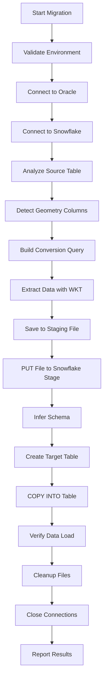

# Oracle to Snowflake Migration Tool - Complete Technical Guide
*Understanding the Staging Approach for Oracle Spatial Data Migration*

## 📚 Table of Contents
1. [Architecture Overview](#-architecture-overview)
2. [Why the Staging Approach](#-why-the-staging-approach)
3. [Complete Process Flow](#-complete-process-flow)
4. [Geometry Conversion Deep Dive](#️-geometry-conversion-deep-dive)
5. [File Staging Mechanics](#-file-staging-mechanics)
6. [Snowflake Integration Details](#️-snowflake-integration-details)
7. [Step-by-Step Technical Process](#-step-by-step-technical-process)
8. [Performance Optimization](#-performance-optimization)
9. [Error Handling Strategy](#️-error-handling-strategy)
10. [Advanced Configuration](#-advanced-configuration)
11. [Troubleshooting Guide](#-troubleshooting-guide)
12. [Best Practices](#-best-practices)

---

## 🏗️ Architecture Overview

### System Architecture Diagram


### Component Breakdown

**1. DatabaseConnector Class**
- Manages Oracle and Snowflake connections
- Handles authentication and session management
- Provides connection pooling and error recovery

**2. GeometryHandler Class**
- Detects Oracle spatial columns automatically
- Converts STOGeometry to WKT format
- Builds optimized SQL queries with geometry functions

**3. FileStager Class**
- Creates local staging files in various formats
- Manages compression and file organization
- Handles cleanup and disk space management

**4. SnowflakeStager Class**
- Uploads files to Snowflake internal stages
- Manages schema inference and table creation
- Executes COPY INTO commands for data loading

**5. StagingDataMigrator Class**
- Orchestrates the entire migration process
- Provides progress tracking and error handling
- Manages the workflow between all components

---

## 🎯 Why the Staging Approach?

### Traditional Direct Transfer vs. Staging Approach

**Direct Transfer (Our Previous Method):**
```python
Oracle → pandas DataFrame → write_pandas() → Snowflake Table
```
**Problems:**
- ❌ Limited by memory for large datasets
- ❌ No intermediate checkpoint for recovery
- ❌ Difficult to handle geometry conversion
- ❌ All-or-nothing approach

**Staging Approach (New Method):**
```python
Oracle → File (with WKT) → PUT to Stage → COPY INTO Table
```
**Advantages:**
- ✅ Handles unlimited data sizes
- ✅ Provides intermediate checkpoints
- ✅ Supports complex data transformations
- ✅ Follows Snowflake best practices
- ✅ Enables recovery from failures
- ✅ Supports multiple file formats

### Why Snowflake Recommends Staging

1. **Performance**: COPY INTO is optimized for bulk loading
2. **Reliability**: Staged files can be reprocessed if needed
3. **Scalability**: No memory limitations for large datasets
4. **Flexibility**: Support for various file formats and transformations
5. **Monitoring**: Better visibility into loading process
6. **Cost Efficiency**: More efficient use of compute resources

---

## 🔄 Complete Process Flow

### High-Level Workflow


### Detailed Technical Flow

#### Phase 1: Preparation and Connection
1. **Environment Validation**
   ```python
   # Check required environment variables
   required_vars = ['ORACLE_USER', 'ORACLE_PASSWORD', 'SNOWFLAKE_ACCOUNT', ...]
   missing = [var for var in required_vars if not os.getenv(var)]
   ```

2. **Oracle Connection Setup**
   ```python
   # Establish Oracle connection with proper encoding
   dsn = f"{host}:{port}/{service_name}"
   connection = oracledb.connect(user=user, password=password, dsn=dsn)
   ```

3. **Snowflake Connection Setup**
   ```python
   # Connect with warehouse, database, and schema context
   conn = snowflake.connector.connect(
       user=user, password=password, account=account,
       warehouse=warehouse, database=database, schema=schema
   )
   ```

#### Phase 2: Data Analysis and Query Building
1. **Table Structure Analysis**
   ```sql
   -- Analyze Oracle table structure
   SELECT column_name, data_type, data_length, nullable
   FROM user_tab_columns 
   WHERE table_name = UPPER('your_table')
   ORDER BY column_id
   ```

2. **Geometry Column Detection**
   ```sql
   -- Auto-detect spatial columns
   SELECT column_name, data_type
   FROM user_tab_columns 
   WHERE table_name = UPPER('your_table')
   AND (data_type LIKE '%GEOMETRY%' 
        OR data_type LIKE '%SDO%'
        OR column_name LIKE '%GEOM%'
        OR column_name LIKE '%SHAPE%')
   ```

3. **Conversion Query Building**
   ```python
   # Build SELECT with geometry conversion
   for col_name, data_type in all_columns:
       if col_name in geometry_columns:
           select_parts.append(f"{col_name}.GET_WKT() AS {col_name}")
       else:
           select_parts.append(col_name)
   
   query = f"SELECT {', '.join(select_parts)} FROM {table_name}"
   ```

#### Phase 3: Data Extraction and File Creation
1. **Execute Oracle Query with Conversion**
   ```python
   # Extract data using pandas for efficient processing
   df = pd.read_sql(query, oracle_connection)
   ```

2. **File Format Selection and Creation**
   ```python
   # Save based on format preference
   if file_format == 'csv':
       df.to_csv(file_path, index=False, compression='gzip')
   elif file_format == 'parquet':
       df.to_parquet(file_path, index=False, compression='gzip')
   elif file_format == 'json':
       df.to_json(file_path, orient='records', lines=True)
   ```

#### Phase 4: Snowflake Staging and Loading
1. **File Upload to Stage**
   ```sql
   -- PUT command uploads file to internal stage
   PUT file:///path/to/local/file.csv @%table_name
   ```

2. **Schema Inference (Optional)**
   ```sql
   -- Let Snowflake analyze the file structure
   SELECT * FROM TABLE(
       INFER_SCHEMA(
           LOCATION => '@%table_name',
           FILE_FORMAT => 'CSV'
       )
   )
   ```

3. **Table Creation**
   ```sql
   -- Create table based on inferred schema
   CREATE OR REPLACE TABLE target_table (
       column1 VARCHAR,
       column2 NUMBER,
       geometry_column VARCHAR  -- WKT stored as text
   )
   ```

4. **Data Loading via COPY INTO**
   ```sql
   -- High-performance bulk loading
   COPY INTO target_table
   FROM @%table_name
   FILE_FORMAT = (TYPE = 'CSV' SKIP_HEADER = 1)
   ON_ERROR = 'CONTINUE'
   ```

---

## 🗺️ Geometry Conversion Deep Dive

### Understanding Oracle Spatial Data

**Oracle SDO_GEOMETRY Structure:**
```sql
-- Example Oracle geometry
SDO_GEOMETRY(
    2001,                           -- Geometry type (2D Point)
    NULL,                           -- Coordinate system
    SDO_POINT_TYPE(100, 200, NULL), -- Point coordinates
    NULL,                           -- Element info
    NULL                            -- Ordinates
)
```

### WKT Conversion Process

**1. Detection Phase:**
```python
def detect_geometry_columns(self, table_name: str) -> List[str]:
    cursor.execute(f"""
        SELECT column_name, data_type
        FROM user_tab_columns 
        WHERE table_name = UPPER('{table_name}')
        AND (data_type LIKE '%GEOMETRY%' 
             OR data_type LIKE '%SDO%'
             OR column_name LIKE '%GEOM%'
             OR column_name LIKE '%SHAPE%')
    """)
```

**2. Conversion Query Generation:**
```python
# For each geometry column, add WKT conversion
if col_name in geometry_columns:
    select_parts.append(f"{col_name}.GET_WKT() AS {col_name}")
```

**3. WKT Output Examples:**


### Handling Complex Geometries

**Null Geometry Handling:**
```sql
-- Handle NULL geometries gracefully
CASE 
    WHEN geometry_column IS NULL THEN NULL
    ELSE geometry_column.GET_WKT()
END AS geometry_column
```

**Large Geometry Performance:**
```python
# For very large geometries, consider chunking
if geometry_size > threshold:
    # Process in smaller spatial extents
    query += f"WHERE SDO_FILTER(geometry_column, search_window) = 'TRUE'"
```

### Validation and Quality Assurance

**Geometry Validation:**
```sql
-- Check geometry validity before conversion
SELECT COUNT(*) as invalid_geometries
FROM your_table 
WHERE geometry_column IS NOT NULL 
AND SDO_GEOM.VALIDATE_GEOMETRY_WITH_CONTEXT(geometry_column, 0.005) != 'TRUE'
```

**WKT Validation in Snowflake:**
```sql
-- After loading, validate WKT format
SELECT COUNT(*) as invalid_wkt
FROM target_table 
WHERE geometry_column IS NOT NULL 
AND NOT REGEXP_LIKE(geometry_column, '^(POINT|LINESTRING|POLYGON|MULTIPOINT|MULTILINESTRING|MULTIPOLYGON|GEOMETRYCOLLECTION)')
```

---

## 📁 File Staging Mechanics

### File Format Considerations

**CSV Format:**
```python
# Advantages: Universal compatibility, human-readable
# Disadvantages: Larger file sizes, limited data types
df.to_csv(file_path, 
          index=False,           # No row indices
          quoting=csv.QUOTE_ALL, # Quote all fields
          compression='gzip')    # Compress for transfer
```

**JSON Lines Format:**
```python
# Advantages: Preserves complex data structures, schema flexibility
# Disadvantages: Larger than Parquet, slower parsing
df.to_json(file_path, 
           orient='records',    # One object per row
           lines=True,          # Newline-delimited JSON
           compression='gzip')
```

**Parquet Format:**
```python
# Advantages: Columnar storage, excellent compression, preserves types
# Disadvantages: Binary format, requires specific libraries
df.to_parquet(file_path, 
              index=False,
              compression='gzip',
              engine='pyarrow')
```

### File Organization Strategy

**Directory Structure:**
